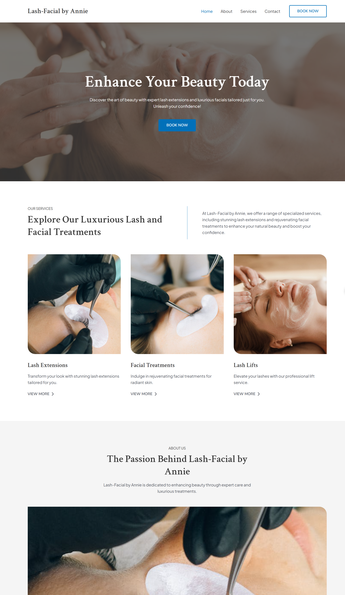

# Lash & Facial by Annie – WordPress Website

This is a custom WordPress website I developed for [Lash & Facial by Annie](https://lash-facialbyannie.com), a beauty and skincare business that offers professional lash and facial services. The site features a clean design, service descriptions, and a custom appointment booking system for individual clients.

---

## 🌐 Live Website

👉 [https://lash-facialbyannie.com](https://lash-facialbyannie.com)

---

## 📸 Preview

  

---

## 🛠️ Built With

- WordPress CMS
- Elementor (drag-and-drop layout builder)
- Appointment Booking Plugin (for customer scheduling)
- PHP, HTML5, CSS3
- Mobile-optimized theme

---

## 🎯 Key Features

- Homepage with service highlights and intro section
- **Client-side appointment booking system**
- Service detail pages with pricing and options
- Contact form and Google Maps integration
- Fully responsive layout for mobile and tablet
- SEO-friendly structure and fast-loading assets

---

## 📁 Project Notes

This project was developed using WordPress and customized to support direct booking by clients. Users can schedule appointments with Annie through the site without calling or emailing, making the experience seamless and professional.

---

## ⚠️ Notes

- This GitHub repo contains only the custom theme or layout code.
- WordPress core files, media, and plugin data are not included for privacy.

---

## 📜 License

This project is provided for portfolio demonstration purposes only. Please do not reuse the design or content without permission.
